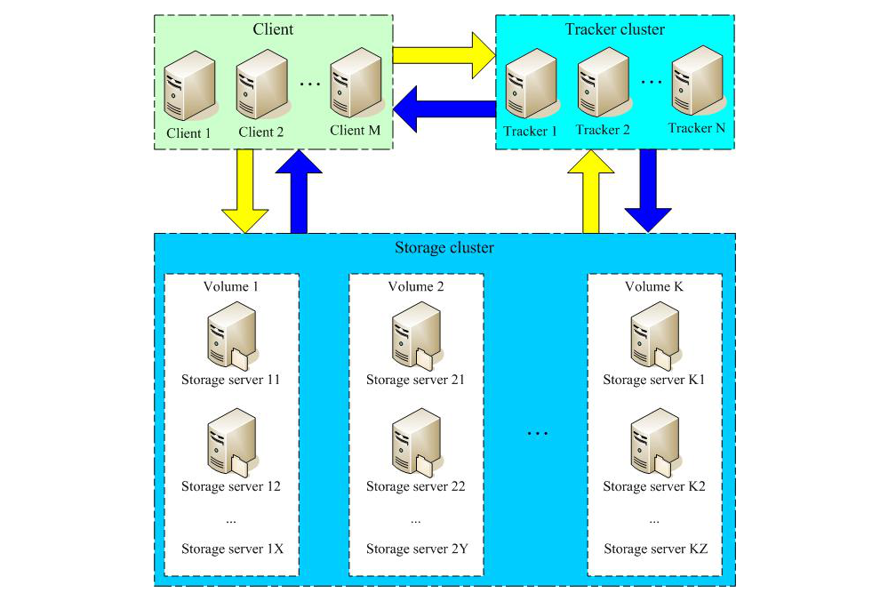

  FastDFS是一款开源的分布式文件系统，功能主要包括：文件存储、文件同步、文件访问（文件上传、文件下载）等，解决了文件大容量存储和高性能访问的问题。FastDFS特别适合以文件为载体的在线服务，如图片、视频、文档等等服务。

  FastDFS作为一款轻量级分布式文件系统，版本V6.01代码量6.3万行。FastDFS用C语言实现，支持Linux、FreeBSD、MacOS等类UNIX系统。FastDFS类似google FS，属于应用级文件系统，不是通用的文件系统，只能通过专有API访问，目前提供了C客户端和Java SDK，以及PHP扩展SDK。

  FastDFS为互联网应用量身定做，解决大容量文件存储问题，实现高性能和高扩展性。FastDFS可以看做是基于文件的key value存储系统，key为文件ID，value为文件本身，因此称作分布式文件存储服务更为合适。

  FastDFS的架构比较简单，如下图所示：
  

```
  FastDFS特点：
    1）分组存储，简单灵活；
    2）对等结构，不存在单点；
    3）文件ID由FastDFS生成，作为文件访问凭证。FastDFS不需要传统的name server或meta server；
    4）大、中、小文件均可以很好支持，可以存储海量小文件；
    5）一台storage支持多块磁盘，支持单盘数据恢复；
    6）提供了nginx扩展模块，可以和nginx无缝衔接；
    7）支持多线程方式上传和下载文件，支持断点续传；
    8）存储服务器上可以保存文件附加属性。
```

  FastDFS更多更详细的功能和特性介绍，请参阅FastDFS微信公众号的其他文章，搜索公众号：fastdfs。

  FastDFS是轻量级的对象存储解决方案，如果你在数据库、K8s和虚拟机（如KVM）等场景，需要使用通用分布式文件系统，可以了解一下保证数据强一致性且高性能的[FastCFS](https://gitee.com/fastdfs100/FastCFS)。

  我们提供商业技术支持和定制化开发，欢迎微信或邮件洽谈。

  email: 384681(at)qq(dot)com
